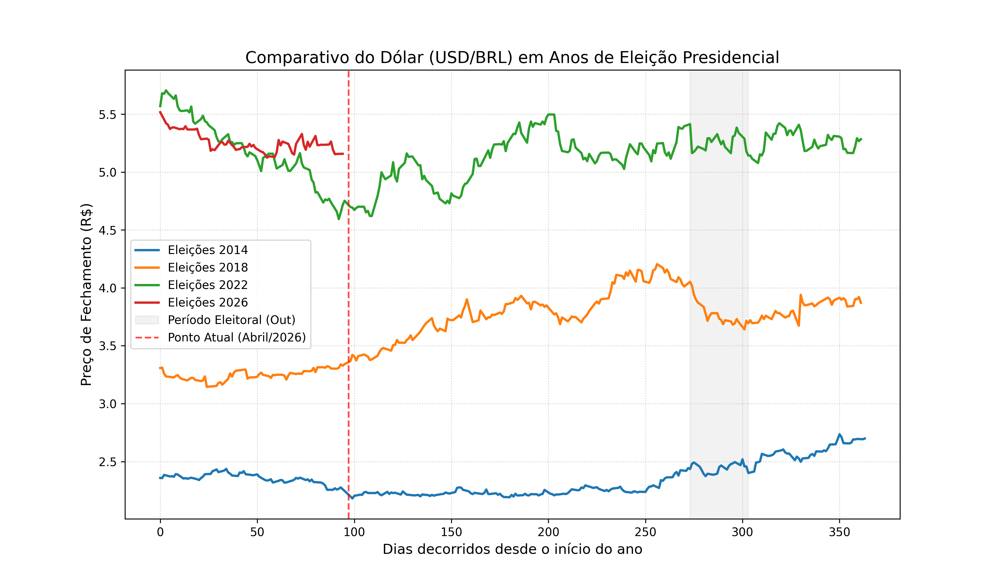

# Análise Comparativa: Dólar em Anos Eleitorais (2014-2026)

Este projeto analisa o comportamento do par **USD/BRL** em anos de eleições presidenciais, focando na janela de oportunidade identificada em abril de 2026.

## 📊 Resultado da Análise

## 🧐 Conclusões
O gráfico mostra se o patamar atual de 2026 está seguindo a tendência de valorização histórica do segundo semestre ou se estamos em um ponto de desvio (dólar barato).

## 🛠️ Como executar
1. Ative o ambiente virtual: `.\venv\Scripts\activate`
2. Instale as dependências: `pip install yfinance pandas matplotlib`
3. Rode o script: `python main.py`